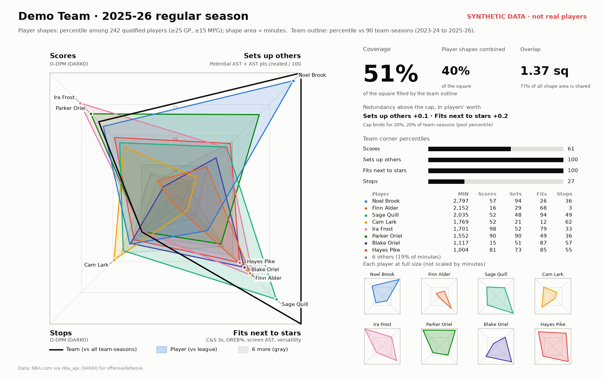

# nba-roster-fit

A stats-based take on Taylormetrics' "Wyman Diagram": a team is a square, each player is a shape,
and a well-built roster fills the square without piling everyone into the same corners.


*The demo uses a made-up league, so the names and numbers are not real.*

## The four corners

| Corner (clockwise from top-left) | Label | Measure |
|---|---|---|
| Offense | Offense | O-LEBRON 80% + DARKO O-DPM 20% |
| Playmaking | Sets up others | 50/50 blend of potential assists and assist points created, per 100 possessions (NBA.com passing tracking) |
| Portability | Fits next to stars | Equal blend of catch-and-shoot 3-point proficiency, OREB%, screen assists per 100, and defensive versatility |
| Defense | Stops | D-LEBRON 80% + DARKO D-DPM 20% |

Offense and defense blend two plus-minus metrics. The 2 : 0.5 weights follow
[Crafted NBA](https://craftednba.com)'s defensive blend, restricted to the sources we can download,
and they live under `impact.weights` in `config.yaml`. LEBRON fixes DARKO's blind spot for on-ball
defenders: Stephon Castle goes from the 5th to the 67th percentile in Stops for 2025-26.

Every component is z-scored within the season's qualified pool (≥25 GP, ≥15 MPG). Each player
gets a percentile per corner, which places a vertex on the diagonal from the center to the corner.

**The rank scale** (`drawing.scale: "rank"`). Talent at the top of the league is spread out far
more than percentiles show: the 4th-best and the 20th-best player in a corner are only 4
percentile points apart. So the distance along the diagonal follows rank instead:
`r = 1 - ln(rank) / ln(1 + n)` for the rank among n qualified players. The best reaches the
corner, and every time the rank halves (20th → 10th → 5th) the vertex moves the same step outward,
about 12% of the way. The 4th-best sits at 76%, the 20th-best at 48%, a median player at 12%, so
superstars' shapes dwarf an all-around role player's. Team outlines use the same scale against all
team-seasons. `scale: "percentile"` puts the vertex at percentile / 100 instead.

**Corner order matters.** Only neighboring corners multiply in a shape's area:
`area = (offense + portability) × (playmaking + defense) / 4`. This order rewards two-way
players (offense next to defense), scorer-creators (offense next to playmaking) and 3-and-D glue
(portability next to defense).

Details on each component:
- **C&S 3-point proficiency** is Ben Taylor's 3-pt proficiency curve applied to catch-and-shoot
  3s: a sigmoid on attempts per 100 times C&S 3P%. The percentage is shrunk toward league average
  by 50 attempts.
- Both composites can be scored two ways (`component_scaling`): plain z-scores, or rank-based
  z-scores. Portability uses rank, so one extreme stat (a center's OREB%) can't outweigh three
  weak ones; playmaking uses plain z.
- **Versatility** is the normalized entropy of a defender's matchup possessions against guards,
  forwards and centers. NBA.com only splits those three ways, so it's coarse.
- **Box Creation** (Taylor's public formula) is available as a playmaking component with weight 0.
  It's left out by default because its points term credits scoring gravity.

## Team numbers

- **Minutes weight:** `w = player minutes / (team minutes / 5)`. Weights sum to 5, so a player
  who plays every minute counts 1.0.
- **Corner sum:** `Σ w × z`.
  - Offense and defense are uncapped, and negative values count against the team.
  - In playmaking and portability, below-average players add 0 instead of a negative, and the sum
    is capped. Anything above the cap is **redundancy**, reported in "players' worth" (one player's
    worth = an 85th-percentile player at 34 MPG).
- **Team corner percentile:** where the (capped) sum ranks among all team-seasons in the window
  (default 2017-18 to 2025-26, about 270 team-seasons).
- **Coverage (the headline):** how much of the square the players' shapes fill together, i.e. does
  *anyone* on the team cover each part of it. Each shape is scaled so its area is proportional to
  minutes relative to the team's minutes leader.
- **Depth (the black outline):** the area of the team outline drawn from the four team corner
  percentiles: how much of each corner the *whole rotation* provides, minutes-weighted and
  compared with history. A team with one elite defender and four weak ones has high coverage at
  Stops but low depth there. Hide the outline with `--no-outline` or `drawing.team_outline: false`.
- **Overlap:** sum of the shape areas − the area they cover together. It can exceed 1 square when
  many shapes stack.
- **Playoff mode** (`--playoffs`): the top 8 by playoff minutes, using regular-season metrics,
  compared against other playoff teams' top 8s.

### The cap: `team.cap_mode`

- `pool_percentile` (default) fills a corner once a team reaches the 80th percentile of
  team-seasons, so it always binds for the top 20%.
- `players_worth` uses `cap_players_worth × one player's worth`. With the zero floor, an average
  roster already adds up to about two players' worth. A cap of 1.75 therefore binds for about
  three quarters of teams, and those corners read "full" almost everywhere.

`rosterfit check` prints how often the cap binds.

## Setup

```bash
python -m venv .venv && source .venv/bin/activate
pip install -e ".[dev]"
python -m rosterfit demo            # synthetic league, no network; writes outputs/demo_regular.png
pytest
```

## Getting real data

**1. NBA.com tables. Run this on your own machine.** stats.nba.com drops requests from cloud
servers, so this step won't work from a hosted environment.

```bash
python -m rosterfit fetch           # 2017-18 to 2025-26: game logs, advanced, passing, C&S, hustle, matchups
```

This is about 60 requests at one per second (more if the matchup endpoint needs per-team calls).
Everything is cached in `data/cache/` and never re-downloaded unless you pass `--refresh`.

**If `fetch` can't connect, download from your browser instead.** NBA.com answers your browser
even when it refuses Python. Generate a download script, paste it into the browser console on
nba.com, and drop the files it saves into `data/manual/nba/`:

```bash
python -m rosterfit browser-script   # writes data/manual/nba/download_nba_stats.js (only what's missing)
```

1. Open https://www.nba.com/stats and open the console: Cmd+Option+J (Mac) or Ctrl+Shift+J
   (Windows). Red errors already there are nba.com's own ads and trackers; ignore them. Type
   `rosterfit` in the console's Filter box to see only the script's messages.
2. Paste the whole script and press Enter. Only if Chrome warns about pasting: type
   `allow pasting`, press Enter, and paste again. Stay on the tab until it prints `Done`, and
   allow multiple downloads if asked.
3. Move the downloaded `nba_stats_<season>.json` files into `data/manual/nba/`.

This is the route to use in GitHub Codespaces, where `fetch` stops right away because NBA.com
ignores cloud servers. Your browser still runs on your own computer, so the script works. Upload
the downloaded files by dragging them onto `data/manual/nba` in the Explorer panel.

The script makes exactly the requests `fetch` would. Single responses saved by hand also work:
in the Network tab, find the `stats.nba.com` request, use "Save response" or "Copy response", and
save it as a `.json` file in `data/manual/nba/`. The importer recognizes which table and season
each response is from (or name the file like `passing_2025-26.json`). Per-game downloads are
converted back to season totals.

Anything in `data/manual/nba/` is copied into the cache every time you run `check`, `plot` or
`fetch`, so there's no separate import step. The script also asks for the playoff versions of the
tracking tables; `check` shows how many of them each season has under "playoffs".

**2. DARKO CSVs. Download these by hand; nothing scrapes darko.app.** Use the CSV download on
darko.app's leaderboard and save one file per season into `data/manual/darko/`, for example
`darko_2025-26.csv`. A single history file with a season or date column also works.

- With a date column, the value on or before the last regular-season game is used.
- Players are matched by an NBA.com id column if the file has one, otherwise by name.
- `rosterfit check` lists any names it couldn't match. Fix those with `impact.name_overrides`.
- If DARKO's column names differ from the defaults, add them under `impact.columns`.

**LEBRON CSVs, also by hand.** In BBall Index's LEBRON database, use the CSV button and save one
file per season into `data/manual/lebron/`, e.g. `lebron-data-2026.csv` (LEBRON's season is the
year it ends: 2026 means 2025-26). The files carry NBA.com ids, so no name matching is needed, and
their offensive and defensive role labels show on the website.

Seasons missing either file are left out of the team pool. With only the 2025-26 files, team
percentiles compare against the 30 teams of that season only. `rosterfit explain --team DEN
--corner defense` shows each player's LEBRON and DARKO pieces next to the blended Stops.

**3. Check and plot**

```bash
python -m rosterfit check
python -m rosterfit plot --team NYK                  # 2025-26 regular season, full roster
python -m rosterfit plot --team NYK --playoffs       # top-8 playoff rotation
python -m rosterfit plot --team NYK --theme dark --out outputs/knicks_dark.png
```

Each plot also writes a CSV next to the PNG with every number behind the picture.

**Compare two teams, or look inside a corner**

```bash
python -m rosterfit compare --team NYK --vs SAS --playoffs   # both top-8 playoff rotations
python -m rosterfit compare --team NYK --vs SAS              # both full regular-season rosters
python -m rosterfit explain --team NYK                       # each player's percentile on every
                                                             # playmaking and portability ingredient
```

The comparison puts both squares side by side, with coverage, combined shape area, overlap and
redundancy between them. Underneath are each team's player table and the four team corner
percentiles on one scale.

## The website

```bash
python -m rosterfit export-web          # your cached data -> outputs/web/
python -m rosterfit export-web --demo   # made-up league, no downloads needed
```

This writes `outputs/web/roster-fit-lab.html`, one self-contained page you can open in a browser.
It has three tools:

- **Teams:** any team-season in the window, full regular-season rotation or playoff top 8.
- **Compare:** two team-seasons side by side, with coverage, depth and overlap in one table.
- **Lineup builder:** pick five players from any season. Each plays equal starter minutes, and the
  page scores the lineup with the same math as the Python package.

- **Cap game:** five rounds; each deals you one team's roster and you sign one player at a position
  you haven't filled (PG, SG, SF, PF, C, in any order), staying under the real salary cap with 3
  rerolls a game. Score: how much of the square your five fill. The daily
  deal is the same for everyone that day, so friends can compare.

The cap game needs this season's contracts. On
[Basketball-Reference's contracts page](https://www.basketball-reference.com/contracts/players.html)
use Share & Export -> "Get as Excel Workbook" (or "Get table as CSV") and save the file in
`data/manual/contracts/`; `export-web` picks up the newest one. Salaries are priced against the
official cap for that season (`SALARY_CAPS` in `sources/contracts.py`; `--cap` overrides it), and
shapes come from the latest stats season, for players with 500+ minutes. Sports Reference asks to be
cited with a link, which the page does.

`rosterfit/web/core.js` repeats the team math for the browser, and `tests/test_web.py` checks it
against `team.py` on every team in the synthetic league. The page and `roster-fit-data.json`
contain NBA.com, DARKO and LEBRON numbers, so `outputs/` stays git-ignored: share the page privately, and
don't commit it to this public repo.

## Configuration

Every weight, cap, threshold, corner order, label and season window lives in
[`config.yaml`](config.yaml), with comments. Unknown keys are rejected, so typos fail loudly.

For your own changes, create `config.local.yaml` next to it with only the keys you change. It is
applied on top of `config.yaml`, is git-ignored, and never blocks a `git pull`. For example:

```yaml
playmaking:
  component_scaling: "rank"
impact:
  name_overrides:
    "Name In The DARKO CSV": "Name On NBA.com"
```

## Data sources and terms

- **NBA.com stats** via [nba_api](https://github.com/swar/nba_api): free and unofficial. Requests
  are paced at one per second and cached. Check NBA.com's terms of use yourself; this is meant for
  personal, non-commercial analysis.
- **DARKO** ([darko.app](https://www.darko.app)): free, with CSV downloads on the site.
- **LEBRON** ([BBall Index](https://www.bball-index.com/)): saved with the CSV button in its LEBRON
  database, for personal use. Not redistributed here.
- **Contracts** ([Basketball-Reference](https://www.basketball-reference.com/contracts/players.html)),
  for the website's cap game only: saved by hand from the site's export menu, cited with a link.
- **Not used:** EPM (paid subscription and API tier), and third-party GitHub mirrors of LEBRON,
  which redistribute it without a license.
- Downloaded data is git-ignored. Don't commit it to a public repo.

## Package layout

```
rosterfit/
  config.py           load + validate config.yaml
  cache.py            parquet cache: data/cache/<season>/<regular|playoffs>/<table>.parquet
  sources/            nba_stats.py (nba_api), manual_nba.py (files saved from the browser),
                      darko.py (your DARKO and LEBRON CSVs), formulas.py (Taylor's formulas),
                      contracts.py (Basketball-Reference contracts, for the cap game)
  metrics/            offense_defense, playmaking, portability, pool (z / percentiles), players
  team.py             weights, caps, redundancy, team percentiles, coverage, overlap
  geometry.py         shapes, areas, union (shapely)
  plot.py             matplotlib chart
  synthetic.py        made-up league for the demo and tests
  explain.py          ingredient breakdown behind playmaking and portability
  web/                the website: app.html (page), core.js (browser math), __init__.py (export)
  cli.py              fetch | browser-script | check | plot | compare | explain | demo | export-web
```

## Next

- A court-map panel (interior/perimeter × offense/defense) under the square.
- Clutch study: team corner coverage vs clutch offensive rating and clutch assist rate.
